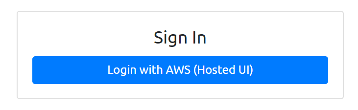
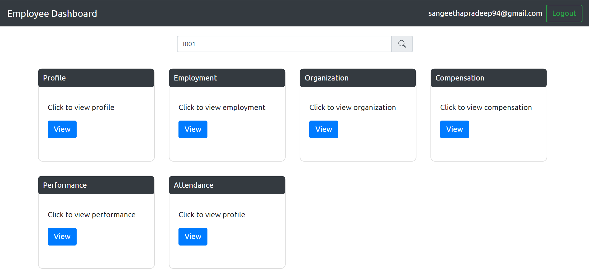
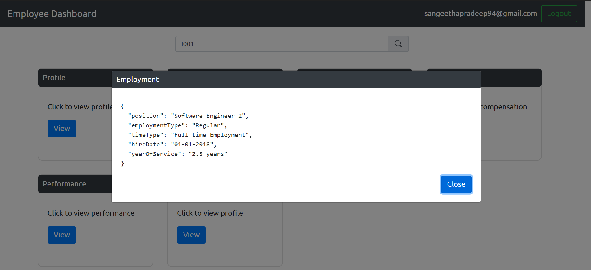

# Angular app integrated with Amplify to login an employee to dashboard

This project was generated with [Angular CLI](https://github.com/angular/angular-cli) version 7.3.9.

This is a simple employee dashboard app with login provided by AWS cognito user pool using amplify library.

## Login screen

## Employee Dashboard screen upon successful login

## On-demand details display pop-up fetched from resource server

## Features:

    1. Login using Cognito user pool
    2. Fetching user details from Identity token
    3. Fetching details from a resource server

## To run the Application:

    1. Run npm i, to install node modules.
    2. Update aws-export.js with your cognito credentials.
    3. Run ng serve -o to build and run the project on brower.

Please, check out the [Employee Resource Server](https://github.com/sangeethapradeep/cognito-spring-employee-app) project

**_References:_** 

["Cognito Hosted UI with Amplify in Angular"](https://medium.com/@arjunsk/cognito-hosted-ui-with-amplify-in-angular-7-26c9285675c4)

**_Motivational Credits:_** 

[Arjun SK](https://github.com/arjunsk)

